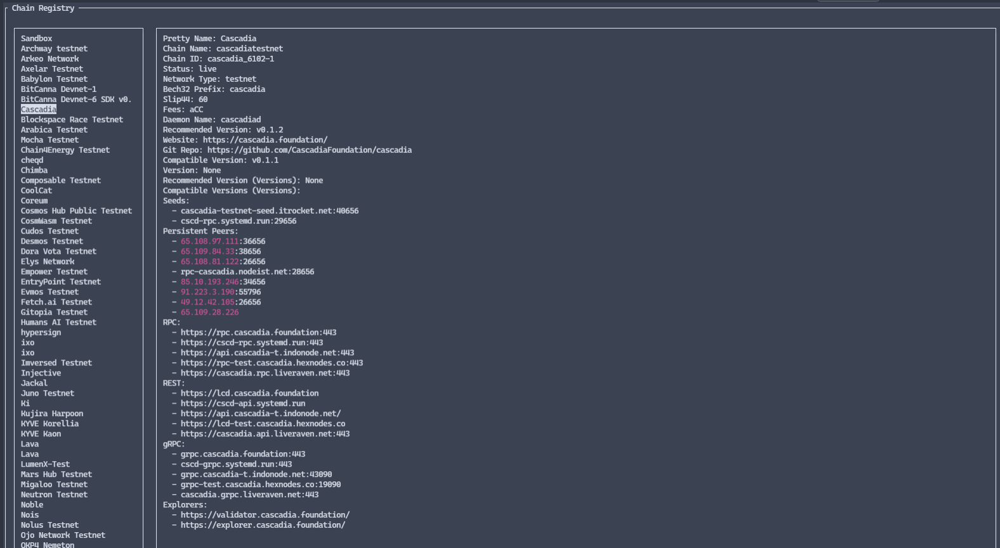

# Chain Registry Browser TUI

Cosmos Chain Registry Browser for command line.

adopted for Cosmos Testnet Catalog of Chain Registry by @ryssroad

## Requirements
 - Python 3.8 or newer

## Run by script
1. `git clone https://github.com/ryssroad/testnet_chain_reg_browser-tui`
2. `cd testnet_chain_reg_browser-tui`
3. `chmod +x runme.sh`
4. `./runme.sh` (need [GitHub Access Token](https://github.com/settings/tokens))

OR   
## Installation
1. Clone repository and create a Python virtual environment
```bash
$ git clone https://github.com/ryssroad/testnet_chain_reg_browser-tui
$ cd testnet_chain_reg_browser-tui
$ python3 -m venv ./venv
$ source venv/bin/activate
(venv) $
```

2. Install the requirements
```bash
(venv) $ python3 -m pip install -r requirements.txt
```

if you want to run this on Windows install additional package:
```bash
pip install windows-curses
```


3. Update `config.json`
```json
{
  "GITHUB_TOKEN": "PLACE_YOUR_TOKEN_HERE"
}
```

4. Run script
```bash
(venv) $ python3 chain_reg_browser.py
```



In case of any questions contact support@chaintools.tech
