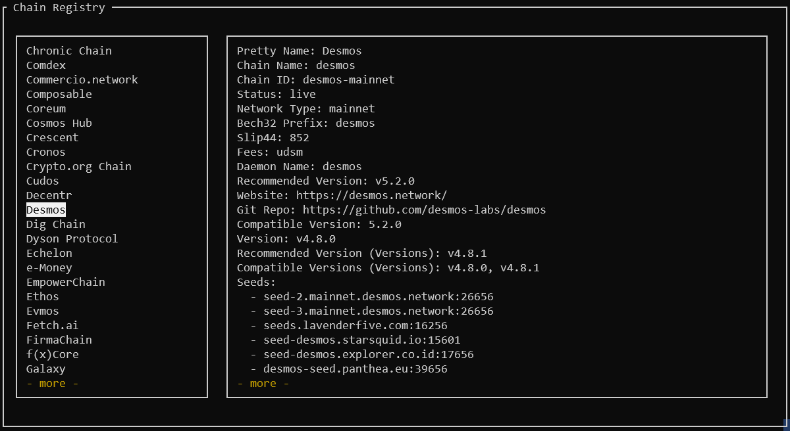

# Chain Registry Browser TUI
Cosmos Chain Registry Browser for command line.

## Requirements
 - Python 3.8 or newer

## Installation

1. Clone repository and create a Python virtual environment
```bash
$ git clone https://github.com/ChainTools-Tech/chain_reg_browser-tui
$ cd chain_reg_browser-tui
$ python3 -m venv ./venv
$ source venv/bin/activate
(venv) $
```

2. Install the requirements
```bash
(venv) $ python3 -m pip install -r requirements.txt
```

if you want to run this on Windows install additional package:
```bash
pip install windows-curses
```


3. Update `config.json`
```json
{
  "GITHUB_TOKEN": "PLACE_YOUR_TOKEN_HERE"
}
```

4. Run script
```bash
(venv) $ python3 chain_reg_browser.py
```



In case of any questions contact support@chaintools.tech
